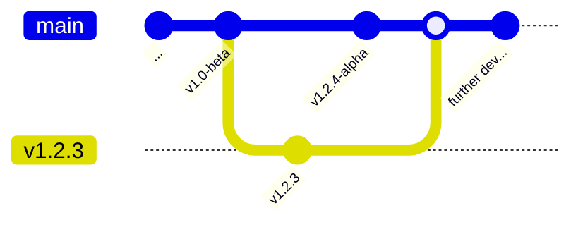
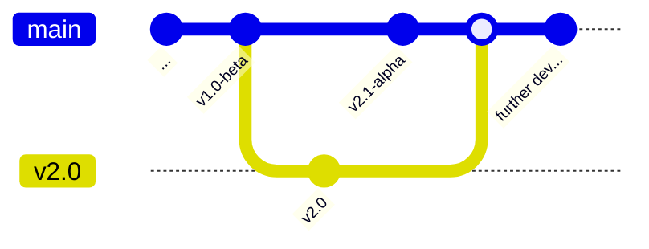

# WebApi starter template

Starting up a new web-api -project with dotnet I find myself repeating a lot of
the same things.

This is a repository with the basic setup:
- devcontainer to develop c# 7 with a postgres database
- a sln -file (proj.sln, should be renamed when using this as a template)
- a web-api project (src/Backend, could be renamed when using this as a template)
- a test project (test/Backend.Tests, could be renamed when using this as a template)
- basic setup for creating and using the database in Backend through Dapper
- basic tests for the Backend using the api exercising:
  - OpenApi (/swagger)
  - healthcheck (/healthz)

## License

GPLv3 - see LICENSE file. This is a template repository, if the license does not work for you - talk to me or create your own repository from scratch.

## Publish command

```bash
cd src/Backend
dotnet publish --os linux --arch x64 -p:PublishProfile=DefaultContainer -c Release
```

## Versioning

[NerdBank.GitVersioning](https://github.com/dotnet/Nerdbank.GitVersioning) has been added to the project. This means that the version is automatically updated based on the git history. Control the main numbers of the version in the file `version.json`, in the root of the repository. The file `Directory.Build.props` tells `msbuild` to use NerdBank.GitVersioning to set the version of the project.

### How to create a new version

The base version-number is controlled by the file `version.json`. If you want to set a specific version you can modify that file's `version` -property. There is a [command-line tool](https://github.com/dotnet/Nerdbank.GitVersioning/blob/main/doc/nbgv-cli.md) to automatically set versions *and* create git-branches with tags for the version. To install it, run the following command:

```bash
dotnet tool install -g nbgv
```

Make sure you are on the `main` -branch with no uncommitted changes and in the folder for the project you want to release and run the following command:

```bash
nbgv prepare-release
```

This will read the current version from `version.json`, create a new branch for that version with an updated `version.json` without any pre-release -tags, move back to the `main` -branch and incremenet the `version.json` adding a pre-release -tag. It will also create a git-tag for the version.

#### Example

The current version is 0.1-beta on the `main` -branch. Running `nbgv prepare-release` will create a new branch `v0.1` with the version 0.1 and an updated `version.json` without any pre-release -tags. It will then move back to the `main` -branch and increment the `version.json` to 0.2-alpha.


To move directly to a specific version-number (e.g. 1.2.3), run the following command:

```bash
nbgv prepare-release --version 1.2.3
```



To move to the next major version, run the following command:

```bash
nbgv prepare-release --major
```



To verify the version-number you can start the application and navigate to the `/version` -endpoint. You can also check the version of the compiled binaries using the `exiftool` from the command-line:

```bash
sudo apt-get update
sudo apt-get install -y exiftool
exiftool src/Backend/bin/Debug/net7.0/Backend.dll | grep "Version"
```


## Monitoring

Running the devcontainer will set up an Otel -collector, Prometheus and Jaeger. With these you can monitor what happens in the application. You will find Prometheus at http://localhost:9090 and Jaeger at http://localhost:16686.

## VSCode pleasantries

Tasks have been set up to run tests and the application. With the task `watch run Backend` you will have a running application that you can connect the debugger to, and the task `watch test Backend.Tests` will run the tests for the Backend and watch for changes. Any failing tests will show up in the Problems tab.

## TODO
- [x] ~~Dockerfile~~ Set up docker publish for the Backend
- [x] Github action
- [x] OpenTelemetry setup
- [ ] Documentation -templates
- [x] Architectural decision records -templates