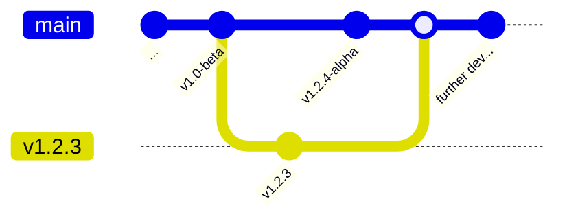
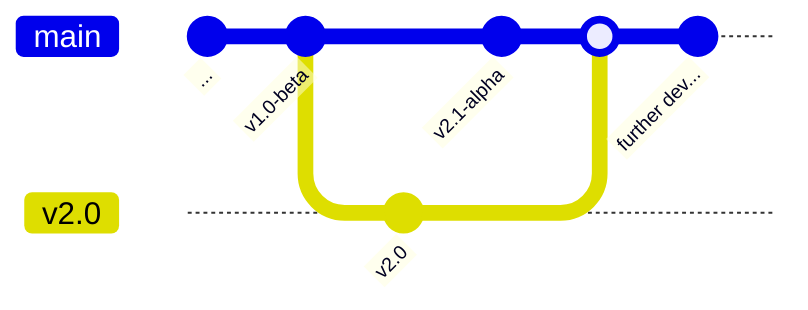

# Versioning

[NerdBank.GitVersioning](https://github.com/dotnet/Nerdbank.GitVersioning) has been added to the project. This means that the version is automatically updated based on the git history. Control the main numbers of the version in the file `version.json`, in the root of the repository. The file `Directory.Build.props` tells `msbuild` to use NerdBank.GitVersioning to set the version of the project.

## How to create a new version

The base version-number is controlled by the file `version.json`. If you want to set a specific version you can modify that file's `version` -property. There is a [command-line tool](https://github.com/dotnet/Nerdbank.GitVersioning/blob/main/doc/nbgv-cli.md) to automatically set versions *and* create git-branches with tags for the version. To install it, run the following command:

```bash
dotnet tool install -g nbgv
```

Make sure you are on the `main` -branch with no uncommitted changes and in the folder for the project you want to release and run the following command:

```bash
nbgv prepare-release
```

This will read the current version from `version.json`, create a new branch for that version with an updated `version.json` without any pre-release -tags, move back to the `main` -branch and incremenet the `version.json` adding a pre-release -tag. It will also create a git-tag for the version.

## Example

The current version is 0.1-beta on the `main` -branch. Running `nbgv prepare-release` will create a new branch `v0.1` with the version 0.1 and an updated `version.json` without any pre-release -tags. It will then move back to the `main` -branch and increment the `version.json` to 0.2-alpha.


To move directly to a specific version-number (e.g. 1.2.3), run the following command:

```bash
nbgv prepare-release --version 1.2.3
```



To move to the next major version, run the following command:

```bash
nbgv prepare-release --major
```



To verify the version-number you can start the application and navigate to the `/version` -endpoint. You can also check the version of the compiled binaries using the `exiftool` from the command-line:

```bash
sudo apt-get update
sudo apt-get install -y exiftool
exiftool src/Backend/bin/Debug/net7.0/Backend.dll | grep "Version"
```
